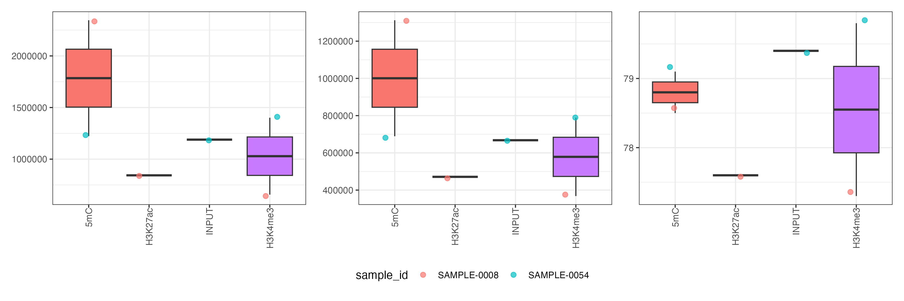
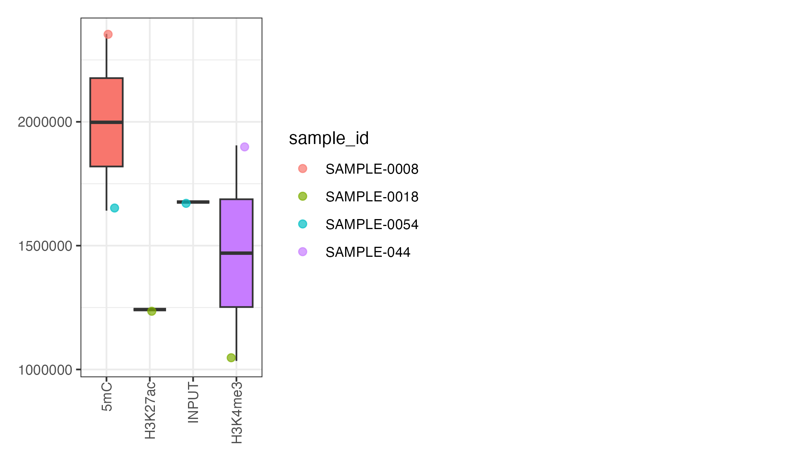

# EpigenicR

> **Private Repository**: This package is maintained in Epigenica's private GitHub space for internal use.

Tools for epigenomic data analysis and visualization, providing a comprehensive framework for processing the data generated by EpiFinder platform (Chromatin and methylation profiles).

## Installation

### Prerequisites

This package depends on `wigglescout`, which requires `future` version 1.34.0. Install dependencies in the following order:

```r
# Install future version 1.34.0
packageurl <- "http://cran.r-project.org/src/contrib/Archive/future/future_1.34.0.tar.gz"
install.packages(packageurl, repos=NULL, type="source")

# Install wigglescout from GitHub
remotes::install_github('cnluzon/wigglescout', build_vignettes = TRUE, force = TRUE)
```

### Install EpigenicR

```r
# Install from Epigenica's private GitHub repository
# (Requires access to Epigenica GitHub organization)
remotes::install_github("epigenica/EpigenicR")

# Or install from local source
devtools::install_local("/path/to/EpigenicR")
```

## Overview


EpigenicR provides tools for:

- **Metadata management**: Extract and organize sample information from BigWig filenames
- **Quality control**: Visualize QC statistics across markers, conditions, and replicates
- **Annotation retrieval**: Download and process GTF/BED files for genomic features
- **ChromHMM integration**: Retrieve chromatin state annotations from Epigenome Roadmap
- **Data structures**: Create EPK (EpiPeaK) objects containing MultiAssayExperiment data
- **Correlation analysis**: Compute sample-sample correlations across markers

## Quick Start
### Dataset Contents

- **6 BigWig files**: Chromatin (H3K4me3, H3K27ac, INPUT) and methylation (5mC) profiles from real samples
- **SAMPLE-0008**: 5mC, H3K27ac, H3K4me3 (3 markers)
- **SAMPLE-0054**: 5mC, INPUT, H3K4me3 (3 markers)
- **stats_summary.txt**: QC statistics table with read counts, duplication rates, and library sizes
- **toy_metadata**: Pre-extracted metadata from filenames (available as R data object)
- **toy_stats_summary**: Processed QC statistics (available as R data object)
- **toy_genes**: Example gene coordinates on chr22 for testing (available as R data object)

**Markers**: 5mC, H3K4me3, H3K27ac, INPUT
**Genome**: hg38 (unscaled BigWig format)
**Total size**: ~13 MB

### 1. Extract Metadata from BigWig Files

```r
library(EpigenicR)

# Create metadata from BigWig filenames
bw_files <- c(
  "project1_batch1_H3K4me3_rerun_sample1_rep1.hg38.scaled.bw",
  "project1_batch1_H3K4me3_rerun_sample1_rep2.hg38.scaled.bw",
  "project1_batch1_H3K9me3_rerun_sample2_rep1.hg38.scaled.bw"
)
# or use list.files() to get actual files from a directory
bw_files <- list.files("inst/extdata/toy_dataset/", pattern = "\\.bw$", full.names = TRUE)

metadata <- create_metadata_df(bw_files = bw_files)
print(metadata)
# A tibble: 6 × 10
#   bw_file                project_id batch marker rerun_id sample_id replicate genome scaling matched
#   <chr>                  <chr>      <chr> <chr>  <chr>    <chr>     <chr>     <chr>  <chr>   <lgl>
# 1 Proj1_A1_5mC_1_SAMPLE… Proj1      A1    5mC    1        SAMPLE-0… pooled    hg38   unscal… TRUE
# 2 Proj1_A1_5mC_1_SAMPLE… Proj1      A1    5mC    1        SAMPLE-0… pooled    hg38   unscal… TRUE
# 3 Proj1_A1_H3K27ac_1_SA… Proj1      A1    H3K27… 1        SAMPLE-0… pooled    hg38   unscal… TRUE
# 4 Proj1_A1_INPUT_1_SAMP… Proj1      A1    INPUT  1        SAMPLE-0… pooled    hg38   unscal… TRUE
# 5 Proj1_B1_H3K4me3_1_SA… Proj1      B1    H3K4m… 1        SAMPLE-0… pooled    hg38   unscal… TRUE
# 6 Proj1_B1_H3K4me3_1_SA… Proj1      B1    H3K4m… 1        SAMPLE-0… pooled    hg38   unscal… TRUE
```

### 2. Download Genomic Annotations
Here you donwload and create BED files for genomic features (genes, CpG islands) and retrieve chormatin states from Epigenome Roadmap. Note that chromatin states can be different for each project here we are using E107 (Skeletal Muscle Male) as an example. Check here for the full list of available chromatin state annotations and additional information [here](https://egg2.wustl.edu/roadmap/web_portal/chr_state_learning.html).

```r
# Ensure GTF file and generate BED files for genes and TSS regions
annotation_paths <- ensure_gtf_and_beds(
  gtf_file = "data/gencode.v38.annotation.gtf",
  gtf_url = "https://ftp.ebi.ac.uk/pub/databases/gencode/Gencode_human/release_38/gencode.v38.annotation.gtf.gz",
  genes_bed = "data/genes.hg38.bed",
  tss2k_bed = "data/genes_tss_2kb.hg38.bed"
)

# Download ChromHMM annotations
# Creatge the folder for chromHMM annotations

download_chromhmm_annotations(
  annotations = c("E107_15_coreMarks_hg38lift_mnemonics.bed"),
  dest_dir = "data/chromHmm_annotations/"
)
```

### 3. Generate QC Plots
In following steps:
- Loading `stats_summary` data frame containing QC statistics for each sample/marker.
- Calculating fraction mapped reads and preparing the data for plotting.
- Using `plot_qc_stats()` to create visualizations of QC metrics across conditions and markers:
  - static (ggplot2)
  - interactive (plotly)

```r
# Prepare QC statistics data frame
stats_summary <- data.frame(
  marker = rep(c("H3K4me3", "H3K9me3", "H3K27me3"), each = 3),
  replicate = rep(c("rep1", "rep2", "rep3"), 3),
  sample_id = rep("sample1", 9),
  condition = "Control",
  total_reads = runif(9, 1e6, 5e6),
  mapped_reads = runif(9, 8e5, 4.5e6),
  library_size = runif(9, 7e5, 4e6)
)
# Or load from actual QC summary tables generated during processing
stats_summary <- read.csv(file.path("inst/extdata/toy_dataset/stats_summary.txt"), sep = "\t", header = T)
# Add fraction mapped
stats_summary <- as_tibble(stats_summary) %>% mutate(frac_mapped = stats_summary$raw_mapped/stats_summary$raw_demultiplexed)
# Remove frac_mapq_filtered column if exists
stats_summary <- stats_summary %>% select(-frac_mapq_filtered)

# Extract markers infromation and metadata from map_id column created by the pipeline
stats_summary <- stats_summary %>%
  mutate(create_metadata_df(map_id_vector = stats_summary$map_id, bw_files = bw_files)[,c("marker","sample_id","batch")], sample_id_rep = paste0(sample_id, '_', batch))

# Create static ggplot2 QC figure
qc_plot <- plot_qc_stats(
  data = stats_summary,
  stats = c("raw_demultiplexed", "frac_mapped", "percent_duplication", "library_size"),
  engine = "ggplot",
  sample_labeling = 'sample_id',
  legend_position = "bottom",
  ncol = 4
)
print(qc_plot)

# Create interactive plotly version
qc_interactive <- plot_qc_stats(
  data = stats_summary,
  sample_labeling = 'sample_id',
  engine = "plotly",
  ncol = 3
)
qc_interactive
```

**Example Output:**
  The toy dataset produces plots like this:

  

  *QC plot showing final mapped reads, library size, and duplication rate for toy dataset samples.*

  ### 4. Create an EPK Object

  EPK (EpiPeaK) objects bundle together:
  - MultiAssayExperiment with multiple genomic feature sets; RPGC values in dataframe format based on provided features coordinates and BigWig files (e.g., genes, CpG islands).
- QC statistics tables; `stats_summary` data frame containing QC metrics for each sample/marker.
- Enrichment results; chromatin state enrichment and profile enrichment tables for each marker/feature set.  For this part you will need to run `wigglescout::plot_bw_loci_summary_heatmap()` and `wigglescout::plot_bw_profile()` functions on your project data and save the results as .csv files in the appropriate directory structure.  You can find examples below and in the `inst/scripts/wigglescout_script.R` script.
- Provenance information; creation timestamp and session info for reproducibility.

#### Prerequisites
Before creating an EPK object, ensure you have:
  - BigWig files (`bw_files`)
- Genomic feature coordinates (e.g., `genes_coord_protein_coding`, `cpg_islands`)
- Marker names vector (`markers`)
- QC statistics table (`stats_summary` from step 3)
- Project directory path (`proj_dir`) for enrichment results

#### Creating Genomic Feature GRanges

Before processing BigWig files, you need to prepare GRanges objects for genomic features:

  ```r
library(GenomicRanges)
library(dplyr)

# ---- Create protein-coding genes GRanges ----

# Path to genes BED file (created by ensure_gtf_and_beds())
genes_coord <- "data/genes.hg38.bed"

# Read BED file and filter for protein-coding genes
genes_coord_protein_coding <- genes_coord %>%
  read.table(sep = "\t", header = FALSE, stringsAsFactors = FALSE) %>%
  filter(V8 == "protein_coding") %>%
  select(V1, V2, V3, V4, V5, V7) %>%
  as.data.frame() %>%
  GenomicRanges::makeGRangesFromDataFrame(
    seqnames.field = "V1",
    start.field = "V2",
    end.field = "V3",
    strand.field = "V7",
    keep.extra.columns = TRUE
  )

# Remove duplicated regions
k_in <- paste0(seqnames(genes_coord_protein_coding), ":",
               start(genes_coord_protein_coding), "-",
               end(genes_coord_protein_coding))
genes_coord_protein_coding <- genes_coord_protein_coding[!duplicated(k_in)]

# Rename genes_coord_protein_coding columns (V4 = gene_name, V5 = gene_id)
colnames(mcols(genes_coord_protein_coding)) <- c("gene_name", "gene_id")

# ---- Create CpG islands GRanges ----

# Path to CpG islands BED file
# Download from UCSC: https://genome.ucsc.edu/cgi-bin/hgTables
# Or use wget:
# system("wget -O data/cpg_islands.hg38.bed.gz 'http://hgdownload.soe.ucsc.edu/goldenPath/hg38/database/cpgIslandExt.txt.gz'")
cpg_coord_gz <- "data/cpg_islands.hg38.bed.gz"
cpg_coord <- gsub(cpg_coord, pattern = "\\.gz$", replacement = "")
# gunzip
R.utils::gunzip(
  cpg_coord,
  destname = cpg_coord,
  overwrite = TRUE,
  remove = TRUE
)
# Read BED file and create GRanges
cpg_islands <- cpg_coord %>%
  read.table(sep = "\t", header = FALSE, stringsAsFactors = FALSE) %>%
  as.data.frame() %>%
  select(V2, V3, V4, V5) %>%
  GenomicRanges::makeGRangesFromDataFrame(
    seqnames.field = "V2",
    start.field = "V3",
    end.field = "V4",
    keep.extra.columns = TRUE
  )

# Rename cpg_islands column and create unique IDs
colnames(mcols(cpg_islands)) <- c("cpg_id")
cpg_islands$cpg_id <- paste(cpg_islands$cpg_id,
                            seqnames(cpg_islands),
                            start(cpg_islands),
                            end(cpg_islands),
                            sep = "_")

# ---- Other feature types (optional) ----

# TSS ±2kb regions
tss_2k  <- promoters(genes_coord_protein_coding, upstream = 2000, downstream = 2000)
# Remove duplicated regions
k_in <- paste0(seqnames(tss_2k), ":",
               start(tss_2k), "-",
               end(tss_2k))
tss_2k <- tss_2k[!duplicated(k_in)]

# Verify GRanges objects
print(genes_coord_protein_coding)
# GRanges object with 5 ranges and 3 metadata columns:
#       seqnames            ranges strand |   gene_name         gene_id      gene_type
#          <Rle>         <IRanges>  <Rle> | <character>     <character>    <character>
#  [1]    chr22 10500000-10510000      + |        TOY1 ENSG00000000001 protein_coding
#  [2]    chr22 10600000-10610000      - |        TOY2 ENSG00000000002 protein_coding
#  [3]    chr22 10700000-10710000      + |        TOY3 ENSG00000000003 protein_coding
#  [4]    chr22 10800000-10810000      + |        TOY4 ENSG00000000004 protein_coding
#  [5]    chr22 10900000-10910000      - |        TOY5 ENSG00000000005 protein_coding
#  -------
#  seqinfo: 1 sequence from an unspecified genome; no seqlengths
print(cpg_islands)
# GRanges object with 32038 ranges and 1 metadata column:
#                         seqnames              ranges strand |                 cpg_id
#                            <Rle>           <IRanges>  <Rle> |            <character>
#       [1]                   chr1 155188536-155192004      * | CpG:_361_chr1_155188..
#       [2]                   chr1     2226773-2229734      * | CpG:_366_chr1_222677..
#       [3]                   chr1   36306229-36307408      * | CpG:_110_chr1_363062..
#       [4]                   chr1   47708822-47710847      * | CpG:_164_chr1_477088..
#       [5]                   chr1   53737729-53739637      * | CpG:_221_chr1_537377..
#       ...                    ...                 ...    ... .                    ...
#   [32034] chr22_KI270734v1_ran..       131009-132049      * | CpG:_102_chr22_KI270..
#   [32035] chr22_KI270734v1_ran..       161256-161626      * | CpG:_55_chr22_KI2707..
#   [32036] chr22_KI270735v1_ran..         17220-18098      * | CpG:_100_chr22_KI270..
#   [32037] chr22_KI270738v1_ran..           4412-5280      * | CpG:_80_chr22_KI2707..
#   [32038] chr22_KI270738v1_ran..           6225-6467      * | CpG:_34_chr22_KI2707..
#   -------
#   seqinfo: 423 sequences from an unspecified genome; no seqlengths
```

#### Step-by-step EPK Creation
This includes:
  - Processing BigWig files per marker using `wigglescout::bw_loci()` and feature set (genes, CpG islands, etc.).
  - Creating assay matrices for each marker and feature set.
  - Building SummarizedExperiment objects.
  - Assembling MultiAssayExperiment.
  - Loading enrichment results.
  - Creating and saving EPK object.
  - Saving summary of the minute-chip pipeline consisting of data such as total reads, mapped reads, duplication rate, etc. is stored in the `stats_summary` table within the EPK object for easy access and visualization.

**Note that the annotation files downloaded above can be used in form of genomic coordinates (GRanges) to extract signal values from BigWig files for each marker and feature set.**


```r
library(wigglescout)
library(SummarizedExperiment)
library(MultiAssayExperiment)

proj_dir <- "."  # Adjust to your project directory containing results

# ---- Step 4a: Process BigWig files per marker and feature set ----

# Initialize assay lists for each feature type
assay_list_protein_coding <- list()
assay_list_tss_2k <- list()
assay_list_cpg_islands <- list()

# Define markers to process (exclude INPUT control)
excluded_markers <- c("INPUT")
markers_to_run <- setdiff(markers, excluded_markers)

# Process each marker
for (mk in markers_to_run) {
  message("Processing marker: ", mk)

  # Filter BigWig files for current marker
  idx <- grep(pattern = mk, x = bw_files, perl = TRUE)
  bw_files_tmp <- bw_files[idx]

  # Select pooled samples (for projects without replicates) OR individual replicates
  # Adjust pattern based on your naming convention:
  #   - 'pooled': for projects without replicates
  #   - 'rep[0-9]+': for projects with replicates (use invert = TRUE)
  idx <- grep(x = bw_files_tmp, pattern = 'pooled', perl = TRUE, invert = FALSE)
  bw_files_marker <- bw_files_tmp[idx]

  # Create sample labels from metadata
  smpl_mixed_name_df <- create_metadata_df(bw_files = bw_files_marker)
  smpl_mixed_name_marker <- paste0(
    smpl_mixed_name_df$sample_id, '_',
    smpl_mixed_name_df$replicate, '_',
    smpl_mixed_name_df$batch
  )

  # Process protein-coding genes
  message("  - Processing protein-coding genes")
  bw_gr_marker <- wigglescout::bw_loci(
    bwfiles = bw_files_marker,
    loci = genes_coord_protein_coding,
    labels = smpl_mixed_name_marker
  )
  colnames(mcols(bw_gr_marker)) <- gsub(
    x = smpl_mixed_name_marker,
    pattern = '\\.',
    replacement = '-'
  )
  m <- as.matrix(S4Vectors::mcols(bw_gr_marker)[, smpl_mixed_name_marker, drop = FALSE])
  storage.mode(m) <- 'numeric'
  assay_list_protein_coding[[mk]] <- m

  # Process tss_2k
  message("  - tss_2k protein-coding genes")
  bw_gr_marker <- wigglescout::bw_loci(
    bwfiles = bw_files_marker,
    loci = tss_2k,
    labels = smpl_mixed_name_marker
  )
  colnames(mcols(bw_gr_marker)) <- gsub(
    x = smpl_mixed_name_marker,
    pattern = '\\.',
    replacement = '-'
  )
  m <- as.matrix(S4Vectors::mcols(bw_gr_marker)[, smpl_mixed_name_marker, drop = FALSE])
  storage.mode(m) <- 'numeric'
  assay_list_tss_2k[[mk]] <- m

  # Process CpG islands
  message("  - Processing CpG islands")
  bw_gr_marker <- wigglescout::bw_loci(
    bwfiles = bw_files_marker,
    loci = cpg_islands,
    labels = smpl_mixed_name_marker
  )
  colnames(mcols(bw_gr_marker)) <- gsub(
    x = smpl_mixed_name_marker,
    pattern = '\\.',
    replacement = '-'
  )
  m <- as.matrix(S4Vectors::mcols(bw_gr_marker)[, smpl_mixed_name_marker, drop = FALSE])
  storage.mode(m) <- 'numeric'
  assay_list_cpg_islands[[mk]] <- m
}

# ---- Step 4b: Create SummarizedExperiment objects ----

# Prepare column metadata
ref_cols <- smpl_mixed_name_marker
coldata <- S4Vectors::DataFrame(sample_id = ref_cols, row.names = ref_cols)

# SummarizedExperiment for protein-coding genes
se_protein_coding <- SummarizedExperiment::SummarizedExperiment(
  assays = assay_list_protein_coding,
  rowRanges = genes_coord_protein_coding,
  colData = coldata
)
rownames(se_protein_coding) <- genes_coord_protein_coding$gene_name

# SummarizedExperiment for tss_2k protein-coding genes

se_tss_2k_protein_coding <- SummarizedExperiment::SummarizedExperiment(
  assays = assay_list_tss_2k,
  rowRanges = tss_2k,
  colData = coldata
)
rownames(se_tss_2k_protein_coding) <- tss_2k$gene_name


# SummarizedExperiment for CpG islands
se_cpg_islands <- SummarizedExperiment::SummarizedExperiment(
  assays = assay_list_cpg_islands,
  rowRanges = cpg_islands,
  colData = coldata
)
rownames(se_cpg_islands) <- cpg_islands$cpg_id

# ---- Step 4c: Create MultiAssayExperiment ----

objlist <- list(
  "protein_coding" = se_protein_coding,
  "cpg" = se_cpg_islands
)
mse <- MultiAssayExperiment::MultiAssayExperiment(
  experiments = objlist,
  colData = coldata
)

# ---- Step 4d: Load enrichment results ----
# enrichment_results should be a list of data frames containing enrichment results for chromatin states and profiles, generated from wigglescout functions and saved as .csv files in your project directory. check the `inst/scripts/wigglescout_script.R` for examples on how to generate and save these results.
data("enrichment_results")
# profile_results should be a list of data frames containing profile enrichment results for each marker/feature set, generated from wigglescout functions and saved as .csv files in your project directory. check the `inst/scripts/wigglescout_script.R` for examples on how to generate and save these results.
data("profile_results")

# ---- Step 4e: Build final EPK object ----

epk <- structure(
  list(
    mse = mse,                                  # Multi-assay data
    tables = list(
      stats_summary = stats_summary             # QC statistics
    ),
    enrichment_results = list(
      chromatin_states = enrichment_results,    # Enrichment tables
      enrichment_profile = profile_results      # Profile data
    ),
    provenance = list(
      created = Sys.time(),                     # Creation timestamp
      session = sessionInfo()                   # Session info
    )
  ),
  class = "EPK"
)

# Save EPK object
saveRDS(epk, "data/project.epk.rds")
message("EPK object saved successfully!")
print(epk)
# EPK object
# -----------
#   * Experiments:
#   - protein_coding: 19954 features × 2 samples, 3 assays
# - cpg: 32038 features × 2 samples, 3 assays
# * Tables:
#   - stats_summary: 8 rows × 17 cols
# * Enrichment results: 2 tables
# * Created: 2026-03-06 17:55:12
```

#### Loading and Inspecting EPK Objects

```r
# Load an existing EPK object
epk <- readRDS("project.epk.rds")

# Print summary
print(epk)
# EPK object
# -----------
#   * Experiments:
#   - protein_coding: 19954 features × 2 samples, 3 assays
# - cpg: 32038 features × 2 samples, 3 assays
# * Tables:
#   - stats_summary: 8 rows × 17 cols
# * Enrichment results: 2 tables
# * Created: 2026-03-06 17:55:12

# Access components
mse <- epk$mse
stats <- epk$tables$stats_summary
enrichment <- epk$enrichment_results

# View available experiments
names(MultiAssayExperiment::experiments(mse))

# Access specific experiment
protein_coding_se <- mse[["protein_coding"]]

# View available markers (assays)
SummarizedExperiment::assayNames(protein_coding_se)
```

### 5. Compute Sample Correlations

```r
# Compute correlations for all markers in a specific experiment
cor_matrices <- compute_all_cor(
  mse = epk$mse,
  exp_name = "protein_coding",
  method = "pearson",
  transform = "log1p"
)

# Access correlation matrix for a specific marker
cor_h3k4me3 <- cor_matrices$H3K4me3
```

## Main Functions

| Function | Description |
|----------|-------------|
| `extract_marker_names()` | Extract marker names from sample IDs |
| `create_metadata_df()` | Parse BigWig filenames into structured metadata |
| `plot_qc_stats()` | Generate QC plots (static or interactive) |
| `ensure_gtf_and_beds()` | Download GTF and create BED files for genes/TSS |
| `download_chromhmm_annotations()` | Retrieve ChromHMM chromatin state annotations |
| `compute_sample_cor()` | Compute sample-sample correlation for one marker |
| `compute_all_cor()` | Compute correlations across all markers |
| `print.EPK()` | Print method for EPK objects |

**Expected Output:**

Multi-panel QC plot:<br>  
  

Single statistic view:<br>  
  

*QC plots generated from the toy dataset showing various quality metrics across epigenetic markers.*

> **Note**: Example plots shown above were generated using `inst/scripts/generate_example_plots.R`. You can regenerate them by running: `Rscript inst/scripts/generate_example_plots.R`

For more details, see `inst/extdata/toy_dataset/README.md`

## Dependencies

Core dependencies:
- `dplyr`, `tidyr`, `stringr`, `tibble` (data manipulation)
- `ggplot2`, `plotly`, `patchwork` (visualization)
- `wigglescout` (BigWig processing)
- `GenomicRanges`, `SummarizedExperiment`, `MultiAssayExperiment` (Bioconductor data structures)

See [DESCRIPTION](DESCRIPTION) for full dependency list.

## Citation

For internal reports and publications using EpigenicR, please cite:

```
EpigenicR: R package for EpiFinder platform data analysis
Epigenica (2026)
Version 0.1.0
Licensed under GPL-3
https://github.com/epigenica/EpigenicR
```

## Acknowledgments

This package builds upon excellent open-source tools from the Bioconductor and R communities:
- **wigglescout** for BigWig processing
- **GenomicRanges** and **SummarizedExperiment** for genomic data structures
- **ggplot2** and **plotly** for visualization
- And many other dependencies listed in [DESCRIPTION](DESCRIPTION)

## License

GPL-3 - Copyright (c) 2026 Epigenica

This package is licensed under GPL-3, ensuring that any derivative works remain open-source. Access is restricted via private GitHub repository. See [LICENSE](LICENSE) file for details.

## Contributing

This package is maintained in Epigenica's private GitHub repository.

For Epigenica team members:
- Submit issues on GitHub: https://github.com/epigenica/EpigenicR/issues
- Create pull requests for new features
- Follow internal development guidelines

## Contact

For questions, issues, or support:
- GitHub Issues: https://github.com/epigenica/EpigenicR/issues
- Package Maintainer: nima.rafati@epigenica.se

---

**Note**: This package is under active development. API may change in future versions.
