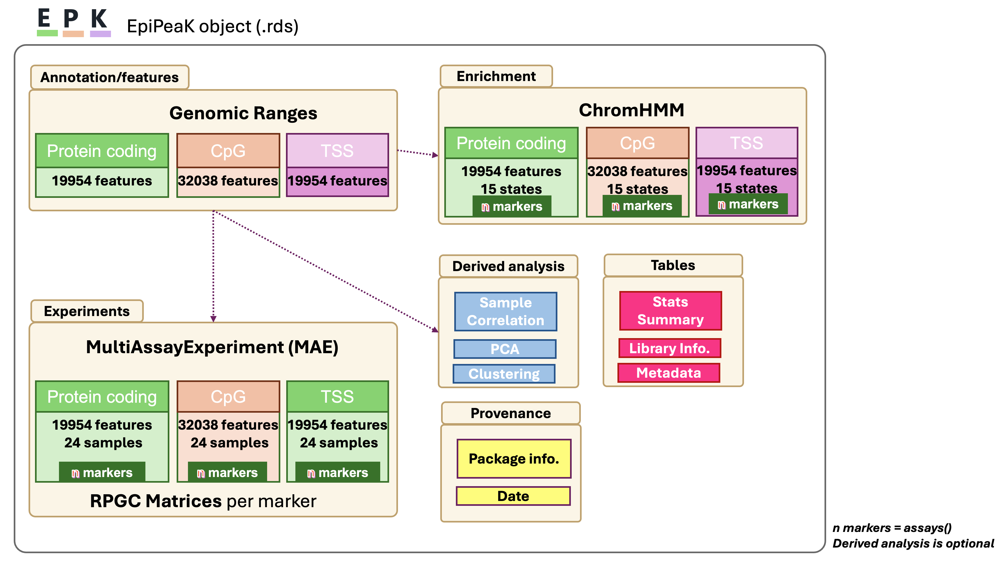
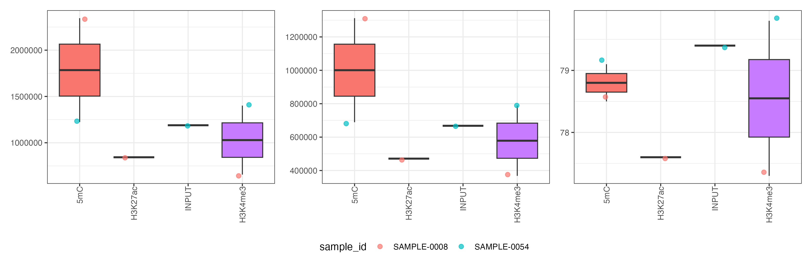

# EpigenicR 

> **Private Repository**: This package is maintained in Epigenica's private GitHub space for internal use.

Tools for epigenomic data analysis and visualization, providing a comprehensive framework for processing the data generated by EpiFinder platform (Chromatin and methylation profiles).

## Installation

### Prerequisites

This package depends on `wigglescout`, which requires `future` version 1.34.0. Install dependencies in the following order:

```r
# Install future version 1.34.0
packageurl <- "http://cran.r-project.org/src/contrib/Archive/future/future_1.34.0.tar.gz"
install.packages(packageurl, repos=NULL, type="source")

# Install wigglescout from GitHub
remotes::install_github('cnluzon/wigglescout', build_vignettes = TRUE, force = TRUE)
```

### Install EpigenicR

```r
# Install from Epigenica's private GitHub repository
# (Requires access to Epigenica GitHub organization)
remotes::install_github("epigenica/EpigenicR")

# Or install from local source by downloading the repository as a ZIP file
# (press the green Code button on the repo, download, uncompress) and run:
devtools::install_local("/path/to/EpigenicR")
```

## Overview

EpigenicR provides tools for:

- **Simplified EPK creation**: `create_epk()` wrapper for streamlined EPK object creation
- **Metadata management**: Extract and organize sample information from BigWig filenames
- **Quality control**: Visualize QC statistics across markers, conditions, and replicates
- **Annotation retrieval**: Download and process GTF/BED files for genomic features
- **ChromHMM integration**: Retrieve chromatin state annotations from Epigenome Roadmap
- **Data structures**: Create EPK (EpiPeaK) objects containing MultiAssayExperiment data
- **Correlation analysis**: Compute sample-sample correlations across markers
- **Methylation analysis**: Calculate and visualize beta values from MBD-seq/CXXC assays
- **Results management**: Load pre-computed enrichment and ChromHMM results into EPK objects

### EPK Object Structure



*The EPK (EpiPeaK) object bundles genomic feature annotations, a MultiAssayExperiment
(RPGC matrices per marker), enrichment results (profile + chromatin states), derived analyses
(correlation, PCA, clustering), QC tables, and provenance into a single `.rds` file.*

---

## Toy Dataset

Stored in `minute_output/` structure (matching EpiFinder pipeline output):

```
inst/extdata/toy_dataset/
└── minute_output/
    ├── bigwig/
    │   └── 8 BigWig files (replicate naming: *.rep1.hg38.unscaled.bw)
    └── reports/
        └── stats_summary.txt
```

**BigWig files** (8 total):

| File | Marker | Sample |
|------|--------|--------|
| `Proj1_A1_5mC_1_SAMPLE-0008_rep1.hg38.unscaled.bw` | 5mC | SAMPLE-0008 |
| `Proj1_A1_5mC_1_SAMPLE-0054_rep1.hg38.unscaled.bw` | 5mC | SAMPLE-0054 |
| `Proj1_A1_H3K27ac_1_SAMPLE-0008_rep1.hg38.unscaled.bw` | H3K27ac | SAMPLE-0008 |
| `Proj1_A1_H3K27ac_1_SAMPLE-0054_rep1.hg38.unscaled.bw` | H3K27ac | SAMPLE-0054 |
| `Proj1_A1_H3K4me3_1_SAMPLE-0008_rep1.hg38.unscaled.bw` | H3K4me3 | SAMPLE-0008 |
| `Proj1_A1_H3K4me3_1_SAMPLE-0054_rep1.hg38.unscaled.bw` | H3K4me3 | SAMPLE-0054 |
| `Proj1_A1_INPUT_1_SAMPLE-0008_rep1.hg38.unscaled.bw` | INPUT | SAMPLE-0008 |
| `Proj1_A1_INPUT_1_SAMPLE-0054_rep1.hg38.unscaled.bw` | INPUT | SAMPLE-0054 |

**R data objects**:

| Object | Description |
|--------|-------------|
| `toy_genes` | GRanges — 5 protein-coding genes on chr22 |
| `toy_metadata` | Tibble — parsed BigWig filename metadata (10 cols) |
| `toy_stats_summary` | Data frame — QC statistics matching BigWig files |
| `enrichment_results` | List — pre-computed chromatin state distributions per marker |
| `profile_results` | List — pre-computed enrichment profiles per marker and annotation |

**Markers**: 5mC, H3K4me3, H3K27ac, INPUT | **Genome**: hg38 | **Format**: unscaled BigWig | **Replicate**: rep1 (use `replicate_mode = "replicate"`)

---

## Workflows

### 1. Create an EPK Object

`create_epk()` is the entry point for all analysis. It supports two modes:

- **Path mode**: point to a `pipeline_output_path`; BigWig files and `stats_summary.txt` are auto-discovered
- **Explicit mode**: supply `bw_files` and `stats_summary` directly

#### Path mode (recommended)

```r
library(EpigenicR)

data(toy_genes)
toy_dir <- system.file("extdata", "toy_dataset", package = "EpigenicR")

epk <- create_epk(
  pipeline_output_path = toy_dir,
  annotations          = toy_genes,
  bigwig_scale         = "unscaled",
  replicate_mode       = "replicate", #toy files are rep1, not pooled
  markers_to_exclude   = c("INPUT")
)
print(epk)
# EPK object
# -----------
# * Markers: 5mC, H3K4me3, H3K27ac
# * Experiments:
#   - genes: 5 features × 2 samples, 3 assays
# * Tables:
#   - stats_summary: 6 rows × 17 cols
# * Enrichment results: 0 tables
# * Created: 2026-04-01 ...
```

`markers_to_exclude` defaults to `c("INPUT")` in `create_epk()`, `add_marker_to_epk()`, and
`add_features_to_epk()`, so the INPUT control track is left out of `epk$mse` by default (it's
an exact, case-sensitive match — a marker parsed as `"Input"` instead of `"INPUT"` would *not*
be excluded). 

**Note: If you want INPUT included as its own assay, set `markers_to_exclude =
character(0)` on the relevant call.** 

#### Explicit mode

```r
toy_dir <- system.file("extdata", "toy_dataset", package = "EpigenicR")

bw_files <- list.files(
  file.path(toy_dir, "minute_output", "bigwig"),
  pattern = "\\.bw$", full.names = TRUE
)
stats_summary <- read.table(
  file.path(toy_dir, "minute_output", "reports", "stats_summary.txt"),
  header = TRUE, sep = "\t", stringsAsFactors = FALSE
)

data(toy_genes)
epk <- create_epk(
  bw_files       = bw_files,
  annotations    = toy_genes,
  stats_summary  = stats_summary,
  replicate_mode = "pooled"
)
```

#### Multiple annotations in one EPK

```r
epk_multi <- create_epk(
  pipeline_output_path = toy_dir,
  annotations = list(
    genes       = toy_genes,
    cpg_islands = "data/cpg_islands.bed",
    enhancers   = "data/enhancers.bed"
  )
)

names(MultiAssayExperiment::experiments(epk_multi$mse))
# [1] "genes" "cpg_islands" "enhancers"
```

#### Restrict to specific markers

Use `markers_to_include` to process only a named subset of the markers detected in the BigWig files.
This filter is applied after `markers_to_exclude`.

```r
epk <- create_epk(
  pipeline_output_path = toy_dir,
  annotations          = toy_genes,
  markers_to_include   = c("H3K4me3", "H3K27me3"),   # only these two
  markers_to_exclude   = c("INPUT"),
  bigwig_scale         = "scaled",
  replicate_mode       = "replicates"
)
```

#### Include batch in column labels

When samples come from multiple batches, set `label_by = "sample_id_batch"` to append
the batch identifier to each column name in the assay matrices — useful for distinguishing
samples across batches in downstream plots.

```r
epk <- create_epk(
  pipeline_output_path = toy_dir,
  annotations          = toy_genes,
  replicate_mode       = "pooled",
  label_by             = "sample_id_batch"   # default: "sample_id"
)
# Column names become e.g. "SAMPLE-0008_A1", "SAMPLE-0054_B1"
```

#### Save and reload

```r
saveRDS(epk, "project.epk.rds")
epk <- readRDS("project.epk.rds")
```
### 1.1 Getting familiar with the EPK 

Now that you have created an EPK object using the toy dataset, it's helpful to explore an EPK generated from a larger, more realistic dataset. This will give you a better understanding of how an EPK object is structured and how its contents are organized.

A pre-generated EPK object is included with the EpigenicR package and is available after installation. You can dynamically locate its file path and load it using:
```r
epk <- readRDS(file.path(find.package("EpigenicR"), "data", "project.epk.rds"))
```
Once you load the EPK you can type `epk` in the console and you will get the following
```r
EPK object
-----------
* Markers: 5mC, H3K27ac, H3K4me3, INPUT #these are the different types of epigenetic signals that were measured
* Experiments:
  - protein_coding: 19954 features × 2 samples, 3 assays #this states that there were 19,954 genes being measured, and that there were 2 biological samples, and that there are 3 different measurements available for each gene.
  - cpg: 32038 features × 2 samples, 3 assays #this shows that there were 32,038 CpG locations in the genome that were measured for 2 different biological samples, and 3 measurements for each CpG site.
* Tables:
  - stats_summary: 8 rows × 17 cols
* Enrichment results: 2 tables
* Created: 2026-03-06 17:55:12 
```
**Overall Picture**

In summary the EPK is like a well organized binder that has the following structure:
```r
epk
│
├── mse (MultiAssayExperiment)
│   │
│   ├── Experiments
│   │   ├── protein_coding
│   │   │    ├── 19,954 features (genes)
│   │   │    ├── 2 samples
│   │   │    └── 3 assays (data matrices)
│   │   │
│   │   └── cpg
│   │        ├── 32,038 features (CpG sites)
│   │        ├── 2 samples
│   │        └── 3 assays (data matrices)
│   │
│   ├── Sample metadata (colData)
│   │      └── Information about each sample
│   │
│   ├── Sample map
│   │      └── Links samples across experiments
│   │
│   └── Metadata
│          └── Additional information about the experiment
│
├── Markers
│   ├── 5mC
│   ├── H3K27ac
│   ├── H3K4me3
│   └── INPUT
│
├── Tables
│   └── stats_summary
│         └── 8 rows × 17 columns
│
├── Enrichment results
│   ├── Table 1
│   └── Table 2
│
└── Created
    └── 2026-03-06 17:55:12
```
You can think of it like this:
- `epk` = the entire project.
- **mse** = the main data container holding all of the experimental measurements.
- **Experiments** (protein_coding, cpg) = different biological datasets.
- **Assays** = the actual numerical data (e.g., enrichment scores, counts, normalized values).
- **Sample metadata** = information about the samples.
- **Sample map** = keeps samples matched correctly across different experiments.
- **Tables** = summary statistics and other tabular results.
- **Enrichment** results* = outputs from downstream analyses.

So when you run:

```r
epk$mse
```
you're opening the main experimental data container inside the EPK object.

Then when you run:
```r
names(epk$mse)
```
you see the experiments (`protein_coding`, `cpg`).

And when you run with the function `assay`:
```r
assay(epk$mse[["protein_coding"]])
assay(epk$mse[["protein_coding"]], "5mC")
assay(epk$mse[["cpg"]])
```
you finally reach the actual matrix of measurements stored for that experiment.

For looking at a specific experiment the following can be done:
```r
protein <- epk$mse[["protein_coding"]]
```

Or if you want to look at a specific assay with in the experiment the following can also be done:
```r
m5C_data <- assay(epk$mse[["protein_coding"]], "5mC")
```

You can then inspect it using the following functions:

| Function | What it tells you |
|----------|--------------------|
| `class(protein)` | Returns the class of the object (often a `SummarizedExperiment`). |
| `dim(protein)` | Returns the number of features × samples. |
| `rownames(protein)` | Lists the feature names (e.g., genes). |
| `colnames(protein)` | Lists the sample names. |
| `assays(protein)` | Lists all available assays (data matrices). |
| `assay(protein)` | Returns the default assay (data matrix). |
| `rowData(protein)` | Displays metadata for each feature (gene). |
| `colData(protein)` | Displays metadata for each sample. |
| `metadata(protein)` | Displays additional metadata about the experiment. |

---

### 2. Add Feature Annotations to an Existing EPK

`add_features_to_epk()` extends an existing EPK with new annotation experiments without
re-reading BigWig files.

```r
data(toy_genes)
toy_dir <- system.file("extdata", "toy_dataset", package = "EpigenicR")

epk <- add_features_to_epk(
  epk         = epk,
  pipeline_output_path = toy_dir,
  annotations = list(
    cpg_islands = "data/cpg_islands.bed",
    enhancers   = "data/enhancers.bed"
  )
)

names(MultiAssayExperiment::experiments(epk$mse))
# [1] "genes" "cpg_islands" "enhancers"
```

Use `overwrite = TRUE` to replace an existing experiment by name.

---

### 3. Add New Marker Assays to an Existing EPK

`add_marker_to_epk()` adds new marker assays (e.g. a newly processed histone mark) to every
experiment already in the EPK. Unlike `add_features_to_epk()` which adds new annotation sets
(row dimension), this function adds new assays within existing experiments (column dimension
stays fixed).

```r
# EPK already contains H3K27me3, H3K4me3, H3K9me3.
# Add H3K27ac from a separate set of BigWig files:
epk <- add_marker_to_epk(
  epk                = epk,
  bw_files           = bw_files_h3k27ac,
  stats_summary      = stats_summary,
  markers_to_include = c("H3K27ac"),
  markers_to_exclude = c("INPUT"),
  bigwig_scale       = "scaled",
  replicate_mode     = "replicates"
)

# Verify the new assay is present
SummarizedExperiment::assayNames(epk$mse[["genes"]])
# [1] "H3K27me3" "H3K4me3" "H3K9me3" "H3K27ac"
```

Use `overwrite = TRUE` to replace an assay that already exists by name.

---

### 4. Extract Metadata from BigWig Files

`create_metadata_df()` parses the EpiFinder naming convention
(`PROJECT_BATCH_MARKER_RERUN_SAMPLE_REPLICATE.GENOME.SCALING.bw`) into structured columns.

```r
data(toy_metadata)
print(toy_metadata)
# A tibble: 6 × 10
#   bw_file                    project_id batch marker  rerun_id sample_id  replicate genome  scaling   matched
#   <chr>                      <chr>      <chr> <chr>   <chr>    <chr>      <chr>     <chr>   <chr>     <lgl>
# 1 Proj1_A1_5mC_1_SAMPLE-0…   Proj1      A1    5mC     1        SAMPLE-0008 pooled   hg38    unscaled  TRUE
# 2 Proj1_A1_5mC_1_SAMPLE-0…   Proj1      A1    5mC     1        SAMPLE-0054 pooled   hg38    unscaled  TRUE
# 3 Proj1_A1_H3K27ac_1_SAMP…   Proj1      A1    H3K27ac 1        SAMPLE-0008 pooled   hg38    unscaled  TRUE
# 4 Proj1_A1_INPUT_1_SAMPLE-…  Proj1      A1    INPUT   1        SAMPLE-0054 pooled   hg38    unscaled  TRUE
# 5 Proj1_B1_H3K4me3_1_SAMP…   Proj1      B1    H3K4me3 1        SAMPLE-0008 pooled   hg38    unscaled  TRUE
# 6 Proj1_B1_H3K4me3_1_SAMP…   Proj1      B1    H3K4me3 1        SAMPLE-0054 pooled   hg38    unscaled  TRUE

# Or parse directly from files
bw_files <- list.files("minute_output/bigwig/", pattern = "\\.bw$", full.names = TRUE)
metadata <- create_metadata_df(bw_files = bw_files)
```

---

### 5. QC Plots

`plot_qc_stats()` generates per-marker boxplots with jittered sample points for any numeric
column in a `stats_summary` data frame.

```r
data(toy_stats_summary)

# Static ggplot2
plot_qc_stats(
  data           = toy_stats_summary,
  stats          = c("raw_demultiplexed", "frac_mapped", "percent_duplication", "library_size"),
  engine         = "ggplot",
  sample_labeling = "sample_id",
  legend_position = "bottom",
  ncol           = 4
)

# Interactive plotly
plot_qc_stats(
  data           = toy_stats_summary,
  engine         = "plotly",
  sample_labeling = "sample_id"
)
```

**Example output:**



*QC plot showing mapped reads, library size, and duplication rate for toy dataset samples.*

`scaling_plot()` visualises the minute scaling ratio (msr) per marker:

```r
# Default: each marker facet has its own y-axis
scaling_plot(
  epk                = epk,
  markers_to_exclude = c("INPUT"),
  sample_labeling    = "sample_id_rep"
)

# Fixed y-axis across all markers (range driven by largest value)
scaling_plot(
  epk                = epk,
  markers_to_exclude = c("INPUT"),
  sample_labeling    = "sample_id_rep",
  facet_scales       = "fixed"
)
```

---

### 6. Compute Sample Correlations

```r
# Correlations for all markers in one experiment
# exp_name must match the annotation list key used in create_epk()
# e.g. list(genes = ...) → exp_name = "genes"
epk <- compute_all_cor(epk, exp_name = "genes", method = "pearson", transform = "log1p")
# Stored in epk$derived$all_cor$genes

# Correlations across all experiments
epk <- compute_sample_cor(epk, method = "pearson", transform = "log1p")
# Stored in epk$derived$sample_cor

# Visualise as a heatmap
heatmap_cor_marker(epk, exp_name = "primary_annotation", marker = "H3K4me3")
```

---

### 7. Beta Value Calculation (Methylation)

For MBD-seq/CXXC products, `calculate_beta_val()` computes beta values from the
`mbdseq` (M2) and `cxxc` (M3) assays using `(M2 + p) / (M2 + M3 + 2p)`.

```r
epk <- calculate_beta_val(
  epk        = epk,
  feature    = "cpg_islands",
  pseudocount = 1,
  method     = "both"     # "raw", "quantile", or "both"
)

# Visualise beta-value distributions
plot_beta_density(
  epk        = epk,
  feature    = "cpg_islands",
  method     = "both"
)
```

---

### 8. Interactive Enrichment Profile

`plot_enrichment_interactive()` renders a multi-sample enrichment profile as an interactive
plotly figure with hover highlighting.

```r
data(profile_results)

# TSS-anchored profile
plot_enrichment_interactive(
  df          = profile_results$H3K4me3$protein_coding,
  marker      = "H3K4me3",
  plot_title  = "H3K4me3 Enrichment at TSS",
  mid_coord   = "start",
  group_by    = "sample_id"
)

# Gene-body-scaled profile (stretch mode)
# Requires profile data generated with plot_bw_profile_mode = "stretch"
plot_enrichment_interactive(
  epk       = epk,
  marker    = "H3K4me3",
  loci      = "protein_coding",
  mid_coord = "stretch"   # 4-tick x-axis: -Xkb | start | end | +Xkb
)
```

`mid_coord = "stretch"` derives the TSS and TES tick positions from `window_bp / bin_size`
and `max(index)` in the profile data — no extra arguments needed.

---

### 9. Genomic Annotations

#### Load protein-coding genes as GRanges

Point to any existing `genes.hg38.bed` file (GENCODE format with biotype in column 8):

```r
library(GenomicRanges)

genes_coord_protein_coding <- read.table(
    "data/genes.hg38.bed", sep = "\t", header = FALSE, stringsAsFactors = FALSE
  ) |>
  subset(V8 == "protein_coding", select = c(V1, V2, V3, V4, V5, V7)) |>
  GenomicRanges::makeGRangesFromDataFrame(
    seqnames.field = "V1", start.field = "V2", end.field = "V3",
    strand.field   = "V7", keep.extra.columns = TRUE
  )

# Remove coordinate duplicates and name the metadata columns
k_in <- paste0(
  GenomicRanges::seqnames(genes_coord_protein_coding), ":",
  GenomicRanges::start(genes_coord_protein_coding),    "-",
  GenomicRanges::end(genes_coord_protein_coding),      ":",
  GenomicRanges::strand(genes_coord_protein_coding)
)
genes_coord_protein_coding <- genes_coord_protein_coding[!duplicated(k_in)]
colnames(S4Vectors::mcols(genes_coord_protein_coding)) <- c("gene_name", "gene_id")
```

#### Download ChromHMM annotations

```r
# Full list: https://egg2.wustl.edu/roadmap/web_portal/chr_state_learning.html
download_chromhmm_annotations(
  annotations = "E107_15_coreMarks_hg38lift_mnemonics.bed",
  dest_dir    = "data/chromHmm_annotations/"
)
```

#### Create gene BED from GTF (optional — only if you don't already have one)

```r
ensure_gtf_and_beds(
  gtf_file  = "data/gencode.v38.annotation.gtf",
  gtf_url   = "https://ftp.ebi.ac.uk/pub/databases/gencode/Gencode_human/release_38/gencode.v38.annotation.gtf.gz",
  genes_bed = "data/genes.hg38.bed",
  tss2k_bed = "data/genes_tss_2kb.hg38.bed"
)
```

---

### 10. ChromHMM Enrichment Analysis

Profile generation and chromatin state annotation are now **separate steps**:

- `run_bw_profile()` — enrichment profile only (PNG + CSV); marker-type agnostic
- `run_chromhmm_histone()` — chromatin state distribution CSV for histone marks
- `run_chromhmm_methylation()` — chromatin state distribution CSV for methylation marks
- `dispatch_jobs()` — parallel dispatch for any of the above

Call `run_bw_profile()` separately whenever you want a profile plot; the ChromHMM
functions no longer produce one automatically.

Both steps use a `bw_df` metadata data frame (columns: `marker`, `sample_id`,
`replicate`, `batch`, `bw_file`) built once from `create_metadata_df()`.
Filter the files to match what `create_epk()` used (`bigwig_scale = "scaled"`,
`replicate_mode = "replicates"`):

```r
pipeline_output_path <- "/path/to/project/minute_output"
bigwig_dir           <- file.path(pipeline_output_path, "bigwig")

bw_files <- list.files(bigwig_dir, recursive = TRUE, full.names = TRUE,
                        pattern = "\\.scaled\\.bw$")
bw_files <- grep("pooled", bw_files, invert = TRUE, value = TRUE)
bw_df    <- create_metadata_df(bw_files = bw_files)

chromhmm_annotation <- "E107_15_coreMarks_hg38lift_mnemonics.bed"
chromhmm_ref        <- gsub("\\.bed$", "", chromhmm_annotation)
```

#### Step 1 — Enrichment profile

Profile outputs go under `output/profile/<loci_name>/<marker>/` so that
`add_results_to_epk()` can load them into `enrichment_profile[[loci_name]][[marker]]`.

The toy dataset below is fully self-contained and can be run as-is.

```r
library(EpigenicR)
data(toy_genes)
toy_dir <- system.file("extdata", "toy_dataset", package = "EpigenicR")

# Discover all BigWig files and derive labels by stripping the .bw extension
all_files      <- list.files(file.path(toy_dir, "minute_output/bigwig"),
                             recursive = TRUE, full.names = TRUE)
all_files_name <- gsub(".bw", "", basename(all_files))

# Histone — TSS-anchored (mode = "start")
run_bw_profile(
  allfiles      = all_files,
  allfiles_name = all_files_name,
  loci          = toy_genes,                        # GRanges of protein-coding genes
  mk            = "H3K4me3",
  output_dir    = "output/profile/protein_coding/H3K4me3",
  mode          = "start",                          # "start" | "end" | "center" | "stretch"
  loci_label    = "Protein coding"
)
```

For a real project, supply your own file list and loci:

```r
loci_gr        <- readRDS("data/genes_protein_coding_gr.rds")
all_files      <- list.files("minute_output/bigwig", pattern = "\\.bw$", full.names = TRUE)
all_files_name <- gsub(".bw", "", basename(all_files))

# Methylation — centered on CpG islands (mode = "center")
run_bw_profile(
  allfiles      = all_files,
  allfiles_name = all_files_name,
  loci          = cpg_gr,
  mk            = "5mC",
  output_dir    = "output/profile/CpG_islands/5mC",
  mode          = "center",
  loci_label    = "CpG islands"
)
```

Output files from `run_bw_profile()`:

| File | Description |
|------|-------------|
| `<marker>_profile_<mode>.png` | Enrichment profile plot |
| `<marker>_profile_<mode>_data.csv` | Profile data table |

#### Parallel dispatch — profile across all markers

Use `dispatch_jobs()` to run one profile job per marker in parallel,
then load all results into the EPK with a single `add_results_to_epk()` call.

```r
loci_name <- "protein_coding"   # becomes the slot key in enrichment_profile
loci_gr   <- genes_coord_protein_coding

unique_markers <- setdiff(unique(epk$tables$stats_summary$marker), "INPUT")
n_workers      <- max(1L, min(length(unique_markers), parallel::detectCores() - 1L))

jobs <- lapply(unique_markers, function(mk) {
  idx    <- bw_df$marker == mk
  files  <- file.path(bigwig_dir, bw_df$bw_file[idx])
  labels <- paste(bw_df$sample_id[idx], bw_df$replicate[idx], sep = "_")
  op     <- file.path("output/profile", loci_name, mk)
  dir.create(op, recursive = TRUE, showWarnings = FALSE)
  list(
    fn   = run_bw_profile,
    mk   = mk,
    args = list(
      allfiles      = files,
      allfiles_name = labels,
      loci          = loci_gr,
      mk            = mk,
      output_dir    = op,
      mode          = "start",
      loci_label    = loci_name
    )
  )
})

dispatch_jobs(jobs, n_workers = n_workers)

# Load profile CSVs into EPK — keyed by loci_name
epk <- add_results_to_epk(epk, results_path = "output/profile")
# epk$enrichment_results$enrichment_profile$protein_coding$H3K4me3
```

#### Step 2 — Chromatin state distribution

Output goes into `output/chromhmm/<chromhmm_ref>/<marker>/` where `<chromhmm_ref>` is
the ChromHMM BED filename without `.bed`. This ensures `add_results_to_epk()` keys
results by ChromHMM reference, so multiple references can coexist in one EPK.

```r
# Histone marks
run_chromhmm_histone(
  bw_df               = bw_df,
  bigwig_dir          = bigwig_dir,
  mk                  = "H3K4me3",
  output_dir          = file.path("output/chromhmm", chromhmm_ref, "H3K4me3"),
  chromHmm_path       = "data/chromHmm_annotations/",
  chromHMM_annotation = chromhmm_annotation,
  product             = "genomepro",
  replicate_type      = "replicate"   # or "pooled"
)

# Methylation (only if 5mC is in the project)
if ("5mC" %in% unique(bw_df$marker)) {
  run_chromhmm_methylation(
    bw_df               = bw_df,
    bigwig_dir          = bigwig_dir,
    mk                  = "5mC",
    output_dir          = file.path("output/chromhmm", chromhmm_ref, "5mC"),
    chromHmm_path       = "data/chromHmm_annotations/",
    chromHMM_annotation = chromhmm_annotation,
    product             = "genomepro",
    replicate_type      = "replicate"
  )
}
```

Output files from `run_chromhmm_histone()` / `run_chromhmm_methylation()`:

| File | Description |
|------|-------------|
| `<marker>_chromatin_state_dist.csv` | Per-state mean RPGC table |
| `.done` | Completion sentinel |

#### Parallel batch run

```r
markers_to_run <- setdiff(unique(epk$tables$stats_summary$marker), "INPUT")
n_workers      <- max(1L, min(length(markers_to_run), parallel::detectCores() - 1L))

jobs <- lapply(markers_to_run, function(mk) {
  op <- file.path("output/chromhmm", chromhmm_ref, mk)
  dir.create(op, recursive = TRUE, showWarnings = FALSE)
  list(
    fn   = run_chromhmm_histone,
    mk   = mk,
    args = list(
      bw_df               = bw_df,
      bigwig_dir          = bigwig_dir,
      mk                  = mk,
      output_dir          = op,
      chromHmm_path       = "data/chromHmm_annotations/",
      chromHMM_annotation = chromhmm_annotation,
      product             = "genomepro"
    )
  )
})

dispatch_jobs(jobs, n_workers = n_workers)
```

| `n_workers` value | Behaviour |
|-------------------|-----------|
| `0L` | Auto: `min(n_markers, detectCores() - 1)` |
| `1L` | Sequential (background process) |
| `N > 1` | Up to N markers run concurrently |

---

### 11. Load Pre-computed Results into EPK

After runs complete, call `add_results_to_epk()` once per output root — profiles and
chromatin states live in separate directories and use different slot keys:

| Root directory | Slot key | Slot path |
|----------------|----------|-----------|
| `output/profile/` | loci name (directory name) | `enrichment_profile[[loci_name]][[marker]]` |
| `output/chromhmm/` | ChromHMM reference (directory name) | `chromatin_states[[chromhmm_ref]][[marker]]` |

```r
# Load enrichment profiles (keyed by loci name)
epk <- add_results_to_epk(epk, results_path = "output/profile")

# Load chromatin state distributions (keyed by ChromHMM reference)
epk <- add_results_to_epk(epk, results_path = "output/chromhmm")

# Results are now accessible:
# epk$enrichment_results$enrichment_profile$protein_coding$H3K4me3
# epk$enrichment_results$chromatin_states$E107_15_coreMarks_hg38lift_mnemonics$H3K4me3
# epk$enrichment_results$chromatin_states$E116_15_coreMarks_hg38lift_mnemonics$H3K4me3  # second ref
```

#### Interactive ChromHMM heatmap

```r
data(enrichment_results)
epk$enrichment_results$chromatin_states <- enrichment_results

interactive_heatmap_chromhmm(
  epk          = epk,
  marker       = "H3K4me3",
  chromhmm_ref = "E107_15_coreMarks_hg38lift_mnemonics",
  show_pooled  = FALSE
)
```

### 12. Attach Sample Metadata

External sample annotations (condition, treatment, batch, etc.) are stored in
`epk$tables$sample_metadata` — a plain data frame keyed by `sample_id`. This is
simpler than writing into `colData(epk$mse)`: `MultiAssayExperiment` requires
`colData` rownames to exactly match the primary sample IDs in `sampleMap`, and
`epk` is a wrapper around an MAE rather than a pure one, so there's no need to
force that constraint here. If you need metadata directly on `colData` for
compatibility with another MAE-based tool, you can always set it yourself
after the fact — see the note at the end of this section.

```r
# metadata_df must have a 'sample_id' column matching epk's sample IDs
# (e.g. clean any formatting differences first, such as stripping a '#')
metadata_df$sample_id <- gsub("#", "", metadata_df$sample_id)

epk$tables$sample_metadata <- metadata_df
```

Join it into profile data for plotting. Profile `sample` columns follow
`{marker}_{sample_id}_{replicate}` (e.g. `H3K4me3_HV175_rep1`):

```r
profile_df |>
  dplyr::mutate(sample_id = sub("^[^_]+_(.+)_[^_]+$", "\\1", sample)) |>
  dplyr::left_join(epk$tables$sample_metadata, by = "sample_id")
```

`plot_enrichment_interactive()` accepts a `metadata` argument directly — build
a `sample` column matching the profile's format and pass it along with
`group_by`:

```r
tmp_metadata <- epk$tables$sample_metadata |>
  dplyr::mutate(sample = paste0("H3K4me3_", sample_id, "_rep1"))

plot_enrichment_interactive(
  epk           = epk,
  marker        = "H3K4me3",
  loci          = "protein_coding",
  metadata      = tmp_metadata,
  metadata_sample_col = "sample",
  group_by      = "condition"
)
```

**Optional: syncing to `colData(epk$mse)`.** If a downstream tool expects
metadata on the `MultiAssayExperiment` itself, set it explicitly — just be
aware `colData<-` requires the replacement `DataFrame`'s rownames to exactly
match `colnames(epk$mse)`, so a plain `dplyr::left_join()` (which doesn't
preserve rownames) isn't safe here:

```r
cd <- as.data.frame(MultiAssayExperiment::colData(epk$mse))
cd$..rn <- rownames(cd)
cd <- dplyr::left_join(cd, metadata_df, by = c("..rn" = "sample_id"))
rownames(cd) <- cd$..rn
cd$..rn <- NULL

MultiAssayExperiment::colData(epk$mse) <- S4Vectors::DataFrame(cd)
```

### 13. Remove Samples from an EPK Object

`remove_samples_from_epk()` drops one or more samples from every slot at once —
`epk$mse` (every experiment, `colData`, `sampleMap`), correlation matrices and
profile tables nested in `epk$enrichment_results` / `epk$derived`, and the
per-replicate rows in `epk$tables$stats_summary`.

```r
epk <- remove_samples_from_epk(epk, samples = c("A.c_rep1", "A.c_rep2"))
```

`samples` must match `colnames(epk$mse)` exactly — a biological sample can span
multiple replicate columns, and rather than guess which ones belong together,
find them explicitly first:

```r
grep("^A.c", colnames(epk$mse), value = TRUE)
# [1] "A.c_rep1" "A.c_rep2" "A.c_rep3"
```

**Gotcha — digit-leading sample IDs.** A purely numeric `sample_id` (e.g.
`"7156"`) isn't a syntactically valid R name, so `make.names()` prepends an
`"X"` wherever it gets applied (some `epk$mse` column-naming paths) but not
everywhere (e.g. `enrichment_profile`'s `sample` column, written straight from
CSV output, keeps the original unprefixed value). The same sample can end up
as both `"X7156_rep1"` and `"7156_rep1"` in different slots of the same
object — check each slot's actual values (`grep("7156", ..., value = TRUE)`)
and call the function once per naming variant if needed. It also only checks
`epk$tables$stats_summary` by `sample_id_rep`, not `sample_id` — filter that
table directly by `sample_id` for edge cases it doesn't catch.

---

## Function Reference

| Function | Category | Key Arguments | Returns / Output |
|----------|----------|---------------|-----------------|
| `create_epk()` | EPK creation | `pipeline_output_path` or `bw_files`, `annotations`, `markers_to_include`, `markers_to_exclude`, `replicate_mode`, `label_by` | `EPK` object |
| `add_features_to_epk()` | EPK creation | `epk`, `annotations`, `pipeline_output_path` or `bw_files`, `bigwig_scale`, `replicate_mode`, `scaling_info_file`, `label_by`, `overwrite` | Updated `EPK` |
| `add_marker_to_epk()` | EPK creation | `epk`, `bw_files` or `pipeline_output_path`, `markers_to_include`, `markers_to_exclude`, `bigwig_scale`, `replicate_mode`, `overwrite` | Updated `EPK` with new assays |
| `add_results_to_epk()` | Results loading | `epk`, `results_path` | Updated `EPK` with enrichment slots populated |
| `remove_samples_from_epk()` | Sample management | `epk`, `samples` | Updated `EPK` with matching samples removed from every slot |
| `create_metadata_df()` | Metadata | `bw_files` or `map_id_vector` | Tibble: project_id, batch, marker, sample_id, replicate, … |
| `extract_marker_names()` | Metadata | `id`, `markers` | Character vector of marker names |
| `plot_qc_stats()` | QC | `data` or `epk`, `stats`, `engine`, `sample_labeling`, `ncol` | `ggplot` or `plotly` figure |
| `scaling_plot()` | QC | `data` or `epk`, `markers_to_exclude`, `sample_labeling`, `facet_scales` | `ggplot` figure |
| `compute_all_cor()` | Correlation | `epk`, `exp_name`, `method`, `transform` | Updated `EPK`; matrices in `epk$derived$all_cor` |
| `compute_sample_cor()` | Correlation | `epk`, `method`, `transform` | Updated `EPK`; matrices in `epk$derived$sample_cor` |
| `heatmap_cor_marker()` | Correlation | `epk`, `exp_name`, `marker` | `ggplot` heatmap |
| `calculate_beta_val()` | Methylation | `epk`, `feature`, `pseudocount`, `method` | Updated `EPK` with beta assays added |
| `plot_beta_density()` | Methylation | `epk`, `feature`, `method` | `ggplot` density figure |
| `plot_enrichment_interactive()` | Visualisation | `df` or `epk`, `marker`, `loci`, `mid_coord` (`"center"` / `"start"` / `"stretch"`), `group_by` | `plotly` figure |
| `interactive_heatmap_chromhmm()` | Visualisation | `epk`, `marker`, `chromhmm_ref`, `show_pooled` | `plotly` heatmap |
| `ensure_gtf_and_beds()` | Annotations | `gtf_file`, `gtf_url`, `genes_bed`, `tss2k_bed` | BED files written to disk |
| `download_chromhmm_annotations()` | Annotations | `annotations`, `dest_dir` | BED files written to disk |
| `run_bw_profile()` | Enrichment profile | `allfiles`, `allfiles_name`, `loci`, `mk`, `output_dir`, `mode` (`"start"` / `"end"` / `"center"` / `"stretch"`), `loci_label` | PNG + CSV profile per marker |
| `resolve_bw_profile_files()` | Enrichment profile | `bw_df`, `bigwig_dir`, `mk`, `product`, `replicate_type`, `extra_markers` | List: `allfiles`, `allfiles_name` |
| `run_chromhmm_histone()` | ChromHMM | `bw_df`, `bigwig_dir`, `mk`, `output_dir`, `chromHmm_path`, `chromHMM_annotation`, `product`, `replicate_type` | `<marker>_chromatin_state_dist.csv` + `.done` |
| `run_chromhmm_methylation()` | ChromHMM | `bw_df`, `bigwig_dir`, `mk`, `output_dir`, `chromHmm_path`, `chromHMM_annotation`, `product`, `replicate_type` | `<marker>_chromatin_state_dist.csv` + `.done` |
| `dispatch_jobs()` | Enrichment | `jobs`, `n_workers` | Runs jobs in parallel; files written by workers |
| `print.EPK()` | Utility | `x` | Console summary of EPK slots and dimensions |

---

## Dependencies

Core dependencies:
- `dplyr`, `tidyr`, `stringr`, `tibble` (data manipulation)
- `ggplot2`, `plotly`, `patchwork` (visualization)
- `wigglescout` (BigWig processing — requires `future` 1.34.0)
- `GenomicRanges`, `SummarizedExperiment`, `MultiAssayExperiment` (Bioconductor)
- `callr`, `future`, `furrr` (parallelisation)

See [DESCRIPTION](DESCRIPTION) for the full dependency list.

---

## Citation

For internal reports and publications using EpigenicR, please cite:

```
EpigenicR: R package for EpiFinder platform data analysis
Epigenica (2026)
Version 1.0.2
Licensed under GPL-3
https://github.com/epigenica/EpigenicR
```

## Acknowledgments

This package builds upon excellent open-source tools from the Bioconductor and R communities:
- **wigglescout** for BigWig processing
- **GenomicRanges** and **SummarizedExperiment** for genomic data structures
- **ggplot2** and **plotly** for visualization

## License

GPL-3 — Copyright (c) 2026 Epigenica

## Contributing

For Epigenica team members:
- Submit issues: https://github.com/epigenica/EpigenicR/issues
- Create pull requests for new features
- Follow internal development guidelines

## Contact

- GitHub Issues: https://github.com/epigenica/EpigenicR/issues
- Package Maintainer: nima.rafati@epigenica.se

---

**Note**: This package is under active development. API may change in future versions.
